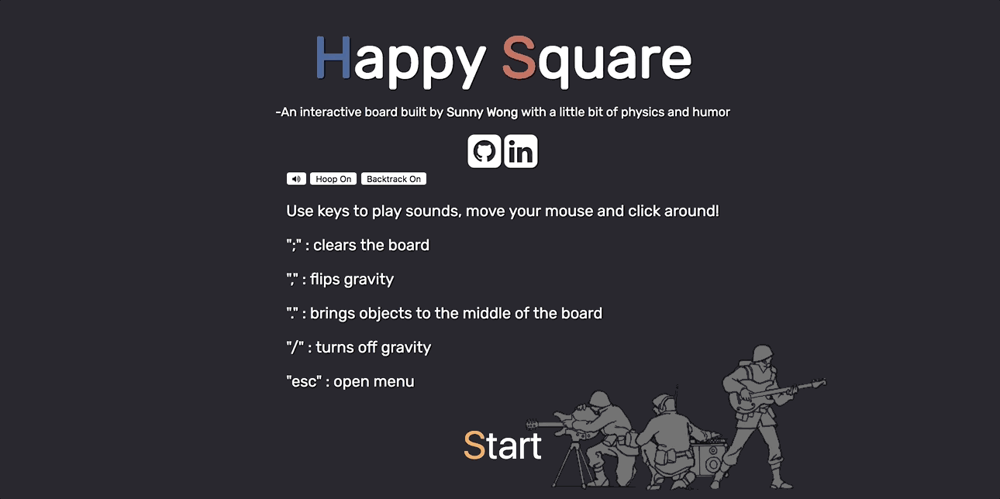

# Happy Square

Happy Square is a interactive visual and audio square! Click anywhere on the screen and see what cool surprises await!

<a target="_blank" href='http://sunnygwong.com/happy-square/'>Live Demo</a>

# Functionality and MVPs
-  Users can click or drag their mouse to trigger audio and visual effects
-  Effects are randomized to create unique experiences

# Wireframes

#Technologies

Vanilla Javascript for overall structure and effects logic
HTML5 canvas for user interface and DOM manipulation
Webpack to bundle dependent scripts

# Timeline

## Day 1
-  Learn basics of Canvas and obtain audio files
-  Set up webpack config and index.html
-  Set up canvas to play audio files and interact with mouse click

## Day 2
-  Create a base of effects triggered on click events with circles and lines
-  Randomize and add a layer of physics to account for velocity, acceleration, gravity and collision.
-  Add bounds to canvas
-  Add audio interaction
-  Add feedback for user

## Day 3
-  Continue Day 2
-  Add mouse interactions with objects on screen
-  Add backtrack

## Day 4
-  Add final styling for the page including personal links
-  Clean and finalize features
